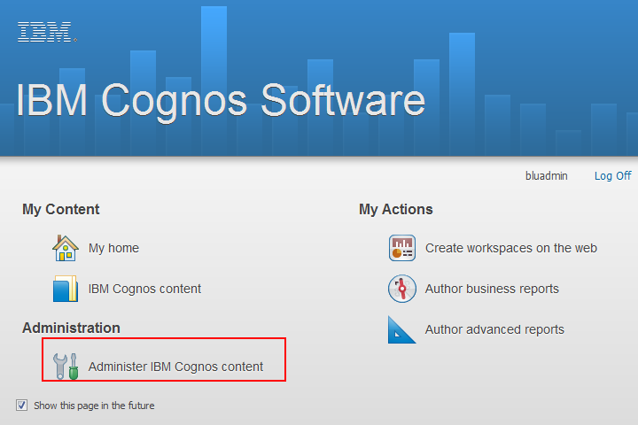
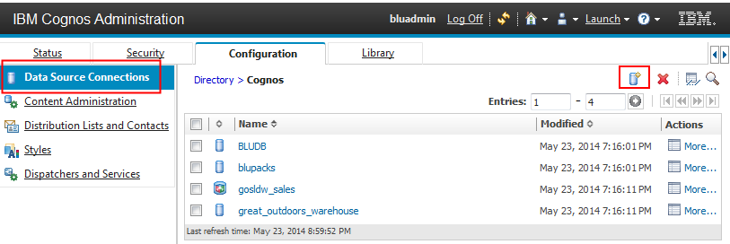
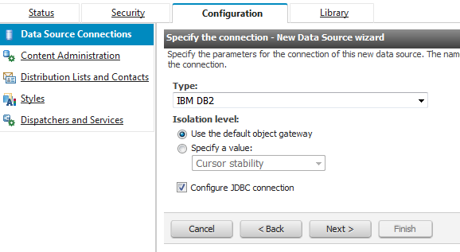
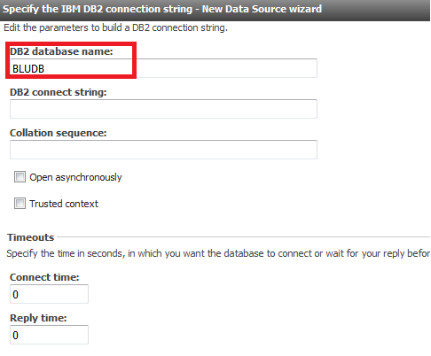
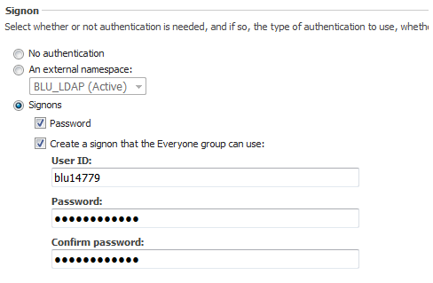
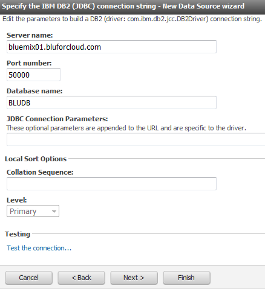

---

copyright:
  years: 2014, 2018
lastupdated: "2018-09-25"

---

<!-- Attribute definitions --> 
{:new_window: target="_blank"}
{:shortdesc: .shortdesc}
{:codeblock: .codeblock}
{:screen: .screen}
{:pre: .pre}

# Connecting Cognos

You can run your IBM Cognos® reports against data in the cloud rather than the data in an on-premises database. After you load your data to a {{site.data.keyword.dashdbshort_notm}} database, you set up the JDBC driver, and then use the Cognos administration tools to create the database connection. These instructions explain how to connect to the database from Cognos version 10.2.1.
{: shortdesc}

## Procedure

To connect to the database from your Cognos server, you need the `db2jcc.jar` file. The `db2jcc.jar` file is part of the [Db2 driver package](driver_pkg.html), which you can download from the web console. The same file is available in the Windows or the Linux download.

### Downloading and installing driver package

**Important**: If the Db2 driver package or the IBM® Data Server Driver Package is already installed on your computer, do not install it again.

1. Download the Db2 driver package from the web console.
   - The Windows package is an executable file that installs multiple drivers on your computer.

   - The Linux package contains the `db2jcc.jar` file within compressed files. You can use the Linux package to access the `db2jcc.jar` file on a Windows computer too. You will need a decompression utility, such as 7-Zip.

2. Locate the db2jcc.jar file:
   - **Windows**: After you run the `ibm_data_server_driver_package_win64_v10.5.exe` file, the `db2jcc.jar` file is installed in the `C:\Program Files\IBM\IBM DATA SERVER DRIVER\java` directory.

   - **Linux**: Decompress the `ibm_data_server_driver_package_linuxx64_v10.5.tar.gz` file, and then decompress the `ibm_data_server_driver_package_linuxx64_v10.5.tar` file. Go to the `dsdriver\jdbc_sqlj_driver\linuxamd64` subdirectory. Decompress the `db2_db2driver_for_jdbc_sqlj.zip` file to access the `db2jcc.jar` file.

3. Copy the `db2jcc.jar` file to the `c10_location\webapps\p2pd\WEB-INF\lib` directory on your Cognos Content Manager computer.

### Connecting to database

Complete the following steps to connect the Cognos server to a {{site.data.keyword.dashdbshort_notm}} database, BLUDB:

1. Collect [connection information](credentials.html).

2. On your Cognos server, start IBM Cognos Administration. Use one of the following methods:
        
   - On the Welcome page, click **Administer IBM Cognos content**.
     

   - In IBM Cognos Connection, from the toolbar, click **Launch > IBM Cognos Administration**.
       
3. From the **Configuration** tab, select **Data Source Connections**.
    
   
    
4. Click the new data source icon . The New Data Source wizard opens.
    
5. In the "Specify a name and description" page, enter a unique name for the BLUDB data source and an optional description and screen tip. Click **Next**.
    
6. In the "Specify the connection" page, select **IBM DB2** for the type and specify the isolation level. Ensure that **Configure JDBC** connection is selected, and then click **Next**.

   

7. In the "Specify the IBM DB2 connection string" page, use the following parameters:
        
   a. Enter `BLUDB` in the **DB2 database name** field.
        
   

   b. Ensure that the **Signons** radio button is selected, and then select the two check boxes for **Password** and **Create a signon that the Everyone group can use:**. Use the user ID and password that you obtained in Step 1. Click **Finish**.

   

8. On the "Specify the IBM DB2 (JDBC) connection string" page, specify the server name and port number that you obtained in Step 1. The database name is `BLUDB`.
    
   

9. Click **Test the connection**, then click **Test**. On the "View the results" page, the status of the connection tests for the dynamic query mode should be **Succeed**. Click **Finish**.

## Results

Your Cognos server is now connected to your {{site.data.keyword.dashdbshort_notm}} database. Use your Cognos tools to create dynamic cubes and start generating reports. The following are resources from the Cognos documentation:

- [Getting started with Cognos Cube Designer ](http://www.ibm.com/support/knowledgecenter/SSEP7J_10.2.1/com.ibm.swg.ba.cognos.ug_cog_rlp.10.2.1.doc/c_ug_cog_rlp_get_started.html){:new_window}

- [Getting started with Report Studio ](http://www.ibm.com/support/knowledgecenter/SSEP7J_10.2.1/com.ibm.swg.ba.cognos.ug_cr_rptstd.10.2.1.doc/c_understand_rs.html){:new_window}

