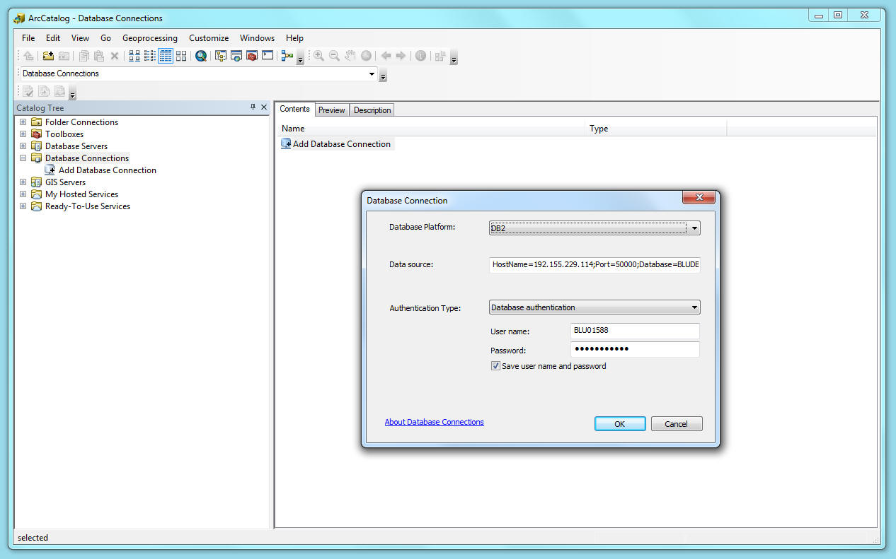

---

copyright:
  years: 2014, 2018
lastupdated: "2018-09-25"

---

<!-- Attribute definitions --> 
{:new_window: target="_blank"}
{:shortdesc: .shortdesc}
{:codeblock: .codeblock}
{:screen: .screen}
{:pre: .pre}

# Connecting Esri ArcGIS for Desktop

You can connect Esri ArcGIS for Desktop version 10.3.1 to a {{site.data.keyword.dashdbshort_notm}} database and then use it to analyze and visualize geospatial data.
{: shortdesc}

## Prerequisites

Before attempting to connect to your {{site.data.keyword.dashdbshort_notm}} database, verify that you have the necessary [prerequisites](connecting.html#prereqs).

<!-- Before you can connect to your database, you must perform the following steps:

- [Verify prerequisites](prereqs.html), including installing driver packages, configuring your local environment, and downloading SSL certificates (if needed)
- Collect [connection information](credentials.html), including database details such as host name and port numbers, and connection credentials such as user ID and password -->

You must have the Db2 driver package or the IBM® Data Server Driver Package installed on your computer.

## Procedure

1. Determine your ODBC DSN data from the [connection information](credentials.html) that you collected beforehand.

2. Create a new connection:
      
   a. In the ArcCatalog Catalog tree, open the Database Connections node and click **Add Database Connection**.
        
   b. In the Database Connections wizard:
   - Select **DB2** from the Database Platform drop-down list.
   - Enter the following string in the **Data source** field:
     ```
     HostName=<hostname>;Port=<port>;Database=<database>;
     CLIENTBUFFERSUNBOUNDLOBS=1;LOBCACHESIZE=50000000;
     FET_BUF_SIZE=256K  
     ```

     where `<hostname>`, `<port>`, and `<database>` are placeholders that represent the host name, port number, and database name that you noted earlier.
            
   - Select **Database authentication** as the authentication type.
            
   - Specify your user name and password (the user ID and password that you noted earlier) in the corresponding fields.
            
   - Press **OK**.
        
     

## Results

The ArcCatalog component of Esri ArcGIS for Desktop is now connected to your {{site.data.keyword.dashdbshort_notm}} database. 