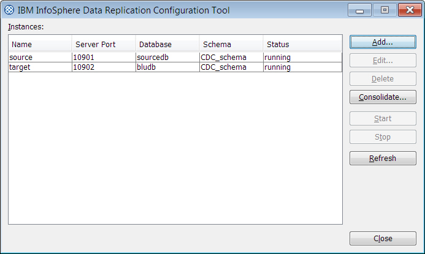
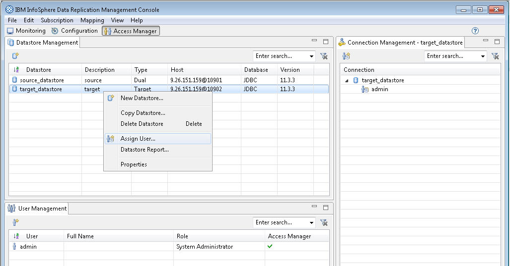

---

copyright:
  years: 2014, 2018
lastupdated: "2018-09-25"

---

<!-- Attribute definitions --> 
{:new_window: target="_blank"}
{:shortdesc: .shortdesc}
{:codeblock: .codeblock}
{:screen: .screen}
{:pre: .pre}

# Connecting InfoSphere Data Replication

You can connect IBM® InfoSphere® Data Replication version 11.3.3.3-36 or later to a {{site.data.keyword.dashdbshort_notm}} database. This capability applies to both SMP and MPP environments. It does not apply to the Entry plan of {{site.data.keyword.dashdbshort_notm}}. 
{: shortdesc}

## Overview

Ideally, when you connect IBM InfoSphere Data Replication to {{site.data.keyword.dashdbshort_notm}}, IBM InfoSphere Data Replication is in the same IBM Cloud™ Data Center as {{site.data.keyword.dashdbshort_notm}} or is colocated with {{site.data.keyword.dashdbshort_notm}}. IBM InfoSphere Data Replication connects from a local server to the remote {{site.data.keyword.dashdbshort_notm}} instance.

When you use {{site.data.keyword.dashdbshort_notm}} as a connection target, the performance of IBM InfoSphere Data Replication partly depends on the bandwidth of the network that separates its target engine from the {{site.data.keyword.dashdbshort_notm}} instance. Physical distance also affects performance: ideally, IBM InfoSphere Data Replication is as close as possible to the {{site.data.keyword.dashdbshort_notm}} instance. Network topology also affects performance. For example, ideally, the IBM InfoSphere Data Replication target engine runs on a VM in the same VPN (security domain) as the target instance. The fewer the network nodes (for example, firewalls or routers) to traverse, the better. 

## Prerequisites

If you intend to connect by using the SSL protocol, download and install GSKit V8. See [GSKit V8 - Install, Uninstall and Upgrade instructions ](http://www.ibm.com/support/docview.wss?uid=swg21631462){:new_window}. Click the operating system tab that applies to your client machine’s operating system. If you are installing the GSKit on a Windows computer, ensure that you specify the GSKit installation directory path (`<installation_directory>\gsk8\bin`) for the **`PATH`** environment variable.

Before attempting to connect to your {{site.data.keyword.dashdbshort_notm}} database, verify that you have the necessary [prerequisites](connecting.html#prereqs).

<!-- Before you can connect to your database, you must perform the following steps:

- [Verify prerequisites](prereqs.html), including installing driver packages, configuring your local environment, and downloading SSL certificates (if needed)
- Collect [connection information](credentials.html), including database details such as host name and port numbers, and connection credentials such as user ID and password -->

If you intend to connect by using the SSL protocol, download the `DigiCertGlobalRootCA.crt` SSL certificate from the web console to a directory on the client machine. To download the certificate, click **Connection > Connection Information** and then click the **Connection with SSL** tab.

## Procedure

1. Choose one of the following approaches to make your connection:

   - To create a connection with SSL, complete the following steps:
            
     a. Issue the following command:

     `cd /<ssl_directory_name>/ssl`

     where `/<ssl_directory_name>/ssl` is the path to the directory into which you downloaded the `DigiCertGlobalRootCA.crt` SSL certificate.

     b. Create a client key database and a stash file by using the **GSKCapiCmd** tool. For example, the following command creates a client key database called `dashclient.kdb` and a stash file called `dashclient.sth`:

     `gsk8capicmd_64 -keydb -create -db "dashclient.kdb" -pw "passw0rdpw0" -stash`

     where `passw0rdpw0` is a password. The **-stash** option creates a stash file in the same path as that of the client key database, with a file extension of `.sth`. At connection time, GSKit uses the stash file to obtain the password to the client key database.
            
     c. Add the certificate to the client key database. For example, the following **gsk8capicmd** command imports the certificate from the `/<ssl_directory_name>/ssl/DigiCertGlobalRootCA.crt` file into the client key database called `dashclient.kdb`:

     `gsk8capicmd_64 -cert -add -db "dashclient.kdb" -pw "passw0rdpw0" -label "DigiCert" -file "/<ssl_directory_name>/ssl/DigiCertGlobalRootCA.crt" -format ascii -fips`

     d. Update the values of the `SSL_CLNT_KEYDB` and `SSL_CLNT_STASH` database manager configuration parameters on the client to specify the client key database and the stash file. Examples follow:

     `db2 update dbm cfg using SSL_CLNT_KEYDB /<ssl_directory_name>/ssl/dashclient.kdb`

     `db2 update dbm cfg using SSL_CLNT_STASH /<ssl_directory_name>/ssl/dashclient.sth`

     e. Catalog the {{site.data.keyword.dashdbshort_notm}} node so that client applications can connect to it. Issue the following command:

     `db2 catalog tcpip node <node_name> remote <Db2_Warehouse_IP_address> server <port_number> security ssl`

     where:
                
     `<node_name>` is your name for the node.

     `<Db2_Warehouse_IP_address>` is the IP address of the Db2 Warehouse on Cloud server.

     `<port_number>` is the port that is used to connect to Db2 Warehouse by using an SSL connection. If you are using the default port, specify `50001`.
            
     f. Catalog the remote {{site.data.keyword.dashdbshort_notm}} database so that client applications can connect to it. Issue the following command:

     `db2 catalog database bludb as <db_alias> at node <node_name>`

     where `db_alias` is your name for the {{site.data.keyword.dashdbshort_notm}} database.
            
     g. Test the SSL connection in one of the following ways:
                
     - Test the connection using CLP by issuing the following command to connect to the {{site.data.keyword.dashdbshort_notm}} database:

       `db2 connect to <db_alias> user <user_id>`

       where `<user_id>` is your {{site.data.keyword.dashdbshort_notm}} user ID. You are prompted to enter your password.
                
     - Test the connection using CLI by issuing the following command to connect to the {{site.data.keyword.dashdbshort_notm}} database:

       `db2cli validate -dsn <alias> -connect -user <user_id> -passwd <password>`

       where `<alias>` is a DSN alias that you created by using the **db2cli writecfg** command, `<user_id>` is your {{site.data.keyword.dashdbshort_notm}} user ID, and `<password>` is your {{site.data.keyword.dashdbshort_notm}} database password.
        
   - To create a connection without SSL, complete the following steps:

     a. Catalog the {{site.data.keyword.dashdbshort_notm}} node so that client applications can connect to it. Issue the following command:

     `db2 catalog tcpip node <node_name> remote <Db2_Warehouse_IP_address> server <port_number>`

     where:
                
     `<node_name>` is your name for the node.

     `<Db2_Warehouse_IP_address>` is the IP address of the {{site.data.keyword.dashdbshort_notm}} server.

     `<port_number>` is the port that is used to connect to {{site.data.keyword.dashdbshort_notm}} without using an SSL connection. If you are using the default port, specify `50000`.
            
     b. Catalog the remote {{site.data.keyword.dashdbshort_notm}} database so that client applications can connect to it. Issue the following command:

     `db2 catalog database bludb as <db_alias> at node <node_name>`

     where `<db_alias>` is your name for the {{site.data.keyword.dashdbshort_notm}} database.

     c. Test the non-SSL connection in one of the following ways:

     - Test the connection using CLP by issuing the following command to connect to the {{site.data.keyword.dashdbshort_notm}} database:

       `db2 connect to <db_alias> user <user_id>`

       where `<user_id>` is your {{site.data.keyword.dashdbshort_notm}} user ID. You are prompted to enter your password.
                
     - Test the connection using CLI by issuing the following command to connect to the {{site.data.keyword.dashdbshort_notm}} database:

       `db2cli validate -dsn <alias> -connect -user <user_id> -passwd <password>`

       where `<alias>` is a DSN alias that you created by using the **db2cli writecfg** command, `<user_id>` is your {{site.data.keyword.dashdbshort_notm}} user ID, and `<password>` is your Db2 Warehouse on Cloud password.
    
2. Launch the InfoSphere Data Replication configuration tool and perform the following steps. The values that are shown in the screen captures are examples.
        
   a. Add a source instance to point to your source database by using the **Instance Configuration** tab:

   

   b. Add a target instance to point to your target Db2 database by using the **Instance Configuration** tab. If you are not using IBM InfoSphere Data Replication 11.3.3.3-50 or later, do not select the **Specify refresh loader path** check box.

   

   c. Start each instance:

   

3. Launch the InfoSphere Data Replication management console and use Access Manager to complete the following steps:
        
   a. Create a datastore to connect to your source instance by using the **Datastore** tab. Because a Db2 database was not originally supported as a source database, you must provide user and password information for the source database by clicking **Connection Parameters**.

   

   b. Create a datastore to connect to your target instance by using the **Datastore** tab. You must provide user and password information by clicking **Connection Parameters**.

   

   c. If the user (for example, admin) that will connect to the Access Server does not exist, create that user:

   

   d. Click the **Access Manager** tab.
        
   e. On the **Datastore Management** tab, assign the user to both the source and target datastores by right-clicking each datastore and then clicking **Assign User**. Ensure that the credentials for accessing each instance are correct.

   

## What to do next

Define a subscription and perform data replication. For information, see [Loading data from InfoSphere Data Replication ](https://www.ibm.com/support/knowledgecenter/SS6NHC/com.ibm.swg.im.dashdb.doc/learn_how/loaddata_iidr.html){:new_window}. 

