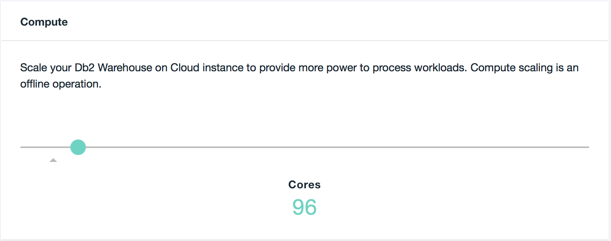

---

copyright:
  years: 2014, 2019
lastupdated: "2019-10-18"

keywords:

subcollection: Db2whc

---

<!-- Attribute definitions --> 
{:external: target="_blank" .external}
{:shortdesc: .shortdesc}
{:codeblock: .codeblock}
{:screen: .screen}
{:tip: .tip}
{:important: .important}
{:note: .note}
{:deprecated: .deprecated}
{:pre: .pre}

# Scaling
{: #scale}

You can independently scale storage and compute for your {{site.data.keyword.dashdblong}} instance. 
{: shortdesc}

The easiest way to scale your {{site.data.keyword.dashdbshort_notm}} instance is through the **Scale Instance** page that can be accessed from the service launch page for your instance.

<!--Before provisioning your Flex Performance system, you make initial adjustments to meet your anticipated requirements for storage and compute cores, then submit your choices.

After your system is provisioned and whenever your requirements change, you can adjust your compute cores and storage requirements by launching the **Scale Instance** page from the service's **Manage** page and by using the slider bars.-->

You can use the sliding bars on the **Scale Instance** page to manage storage and compute cores for your {{site.data.keyword.dashdbshort_notm}} instance. You can scale your instance immediately or schedule a scaling operation to happen later. You can also scale your instance programmatically by using a [REST API](https://cloud.ibm.com/apidocs/db2-warehouse-on-cloud){: external}.

On-demand scaling is charged on an hourly basis. 

Storage scaling occurs online, and compute scaling might incur a few minutes of downtime. During compute scaling, all uncommitted transactions are rolled back. RAM is allocated proportionally with a fixed ratio as the number of compute cores is changed.
{: note} 

<!--## Compute cores
{: #cores}

You can adjust your compute cores up or down. A compute cores change results in a short system downtime of up to 45 minutes. You can schedule the downtime to occur at a time that is more convenient or start the compute cores change immediately.

## Storage
{: #storage}

You can increase your storage. Storage changes do not incur any downtime.

-->

<!--## Memory
{: #ram}

RAM is allocated proportionally with a fixed ratio as the number of compute cores is changed.-->

