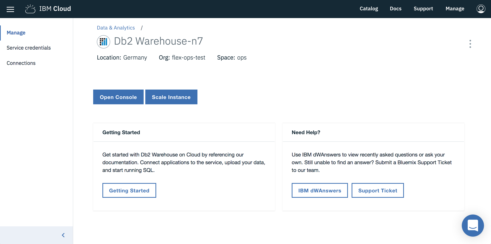

---

copyright:
  years: 2014, 2018
lastupdated: "2018-05-01"

---

<!-- Attribute definitions --> 
{:new_window: target="_blank"}
{:shortdesc: .shortdesc}
{:codeblock: .codeblock}
{:screen: .screen}
{:pre: .pre}

# Flexible scaling
{: #scale}

The Flex Performance plan offers independent scaling of storage and compute cores. 
{: shortdesc}

Before provisioning your Flex Performance system, you make initial adjustments to meet your anticipated requirements for storage and compute cores, then submit your choices.

After your system is provisioned and whenever your requirements change, you can adjust your compute cores and storage requirements by launching the **Scale Instance** page from the service's **Manage** page and using the slider bars.

## Compute cores
{: #cores}

You can adjust your compute cores up or down. A compute cores change results in a short system downtime of up to 45 minutes. You can schedule the downtime to occur at a time that is more convenient or start the compute cores change immediately.

## Storage
{: #storage}

You can increase your storage. Storage changes do not incur any downtime.

## Memory
{: #ram}

RAM is allocated proportionally with a fixed ratio as the number of compute cores is changed.

