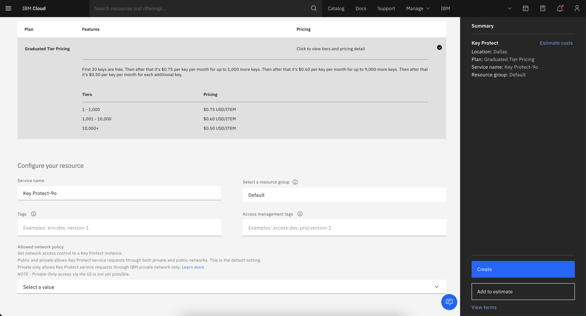
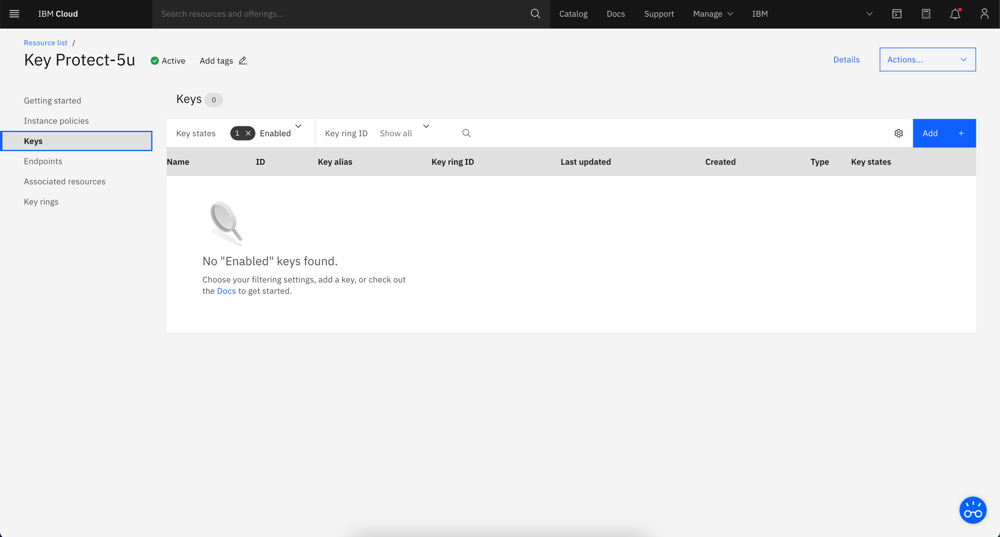
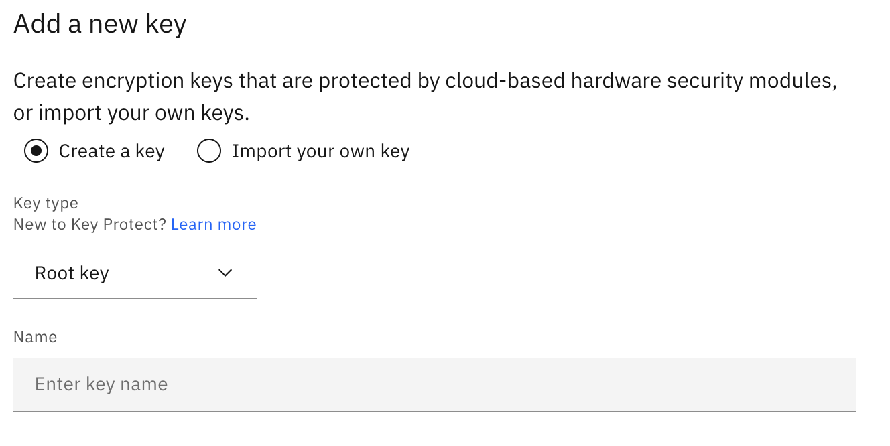
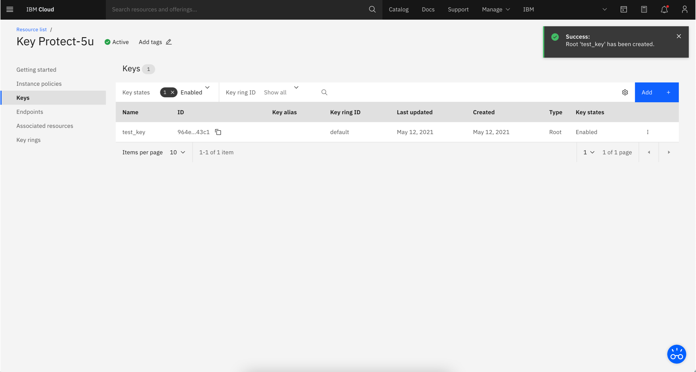
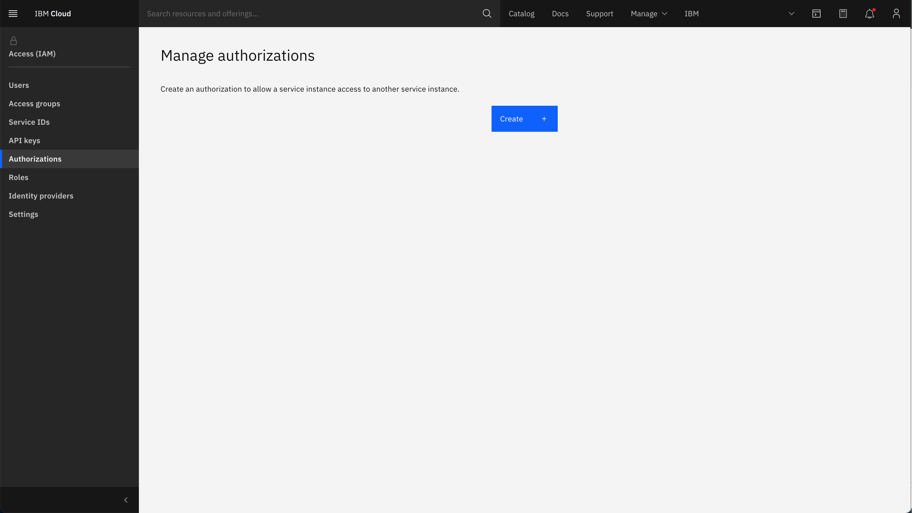
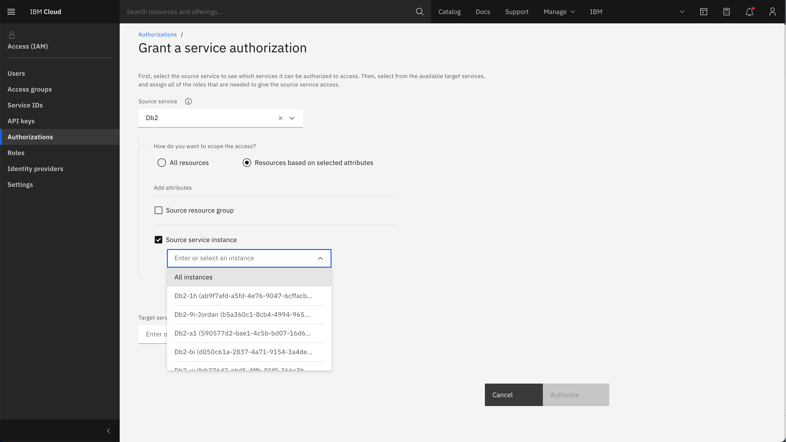
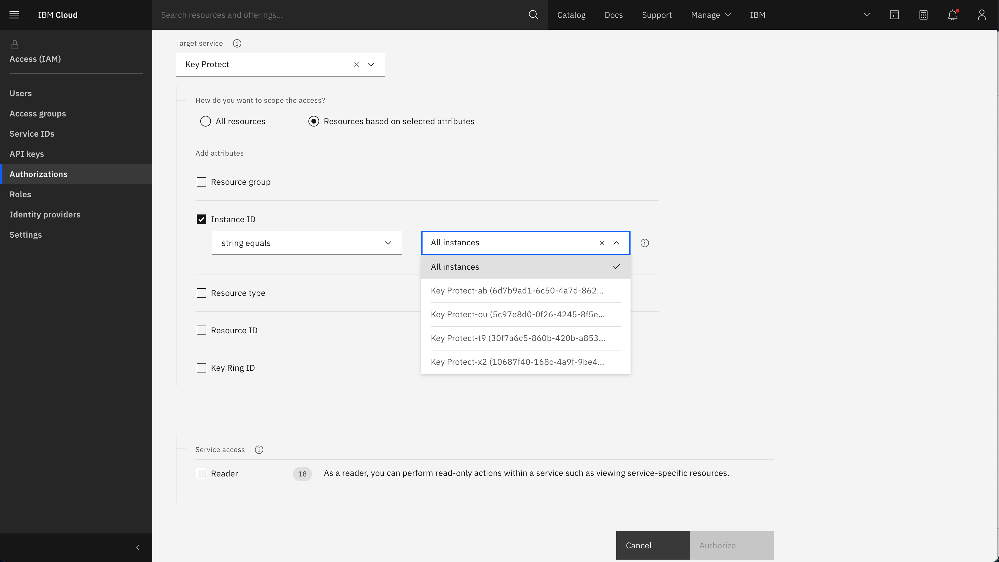
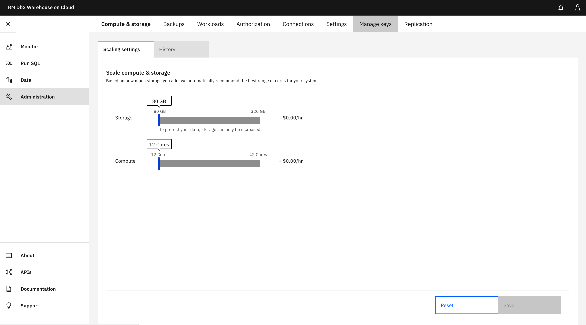
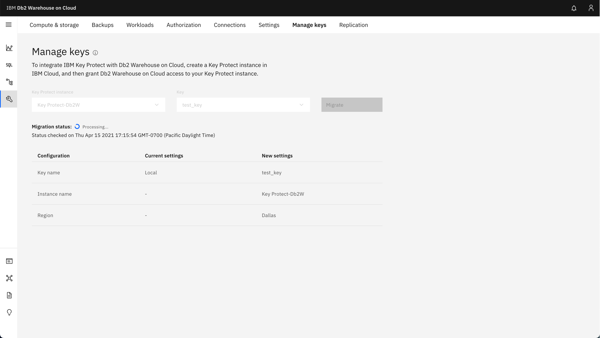

---

copyright:
  years: 2014, 2021
lastupdated: "2021-07-08"

keywords:

subcollection: Db2whc

---

<!-- Attribute definitions -->
{:external: target="_blank" .external}
{:shortdesc: .shortdesc}
{:codeblock: .codeblock}
{:screen: .screen}
{:tip: .tip}
{:important: .important}
{:note: .note}
{:deprecated: .deprecated}
{:pre: .pre}

# IBM Key Protect
{: #key-protect}

With integration of the [IBM Key Protect](/docs/key-protect?topic=key-protect-getting-started-tutorial) service, you can have direct control over the data in your database and backups. You can manage your own keys in the Key Protect service on {{site.data.keyword.Bluemix_notm}} and you can use your key to control the encryption and decryption of the data in your {{site.data.keyword.dashdblong}} database.
{: shortdesc}

Upon instance creation, your database instance is set to encrypt its data at rest by using the Advanced Encryption Standard (AES) in Cipher-Block Chaining (CBC) mode with a 256-bit data encryption key (DEK). This DEK is then encrypted by a master key that is stored in a PKCS#12 keystore. A password is required to open the keystore. With Key Protect integration, the password is encrypted by a Key Protect root key. You must create a root key in Key Protect and grant your specific {{site.data.keyword.dashdbshort_notm}} instance (resource) `Reader` access to that root key. In the {{site.data.keyword.dashdbshort_notm}} web console, you specify the Key Protect instance and the root key to be used. After the association is complete, the specified root key is then used by {{site.data.keyword.dashdbshort_notm}} to encrypt and decrypt the keystore password. The root key never leaves Key Protect.

You can rotate the root key in Key Protect. The database instance periodically checks for any key rotation. When a key rotation is detected, a new keystore password and a new master key is correspondingly generated.

When you revoke the root key authorization of the {{site.data.keyword.dashdbshort_notm}} service or delete the root key, your database instance can no longer be started after it is stopped because any attempt to access the keystore will fail. Certain operations within the database require access to the keystore and they will begin to fail as well. In addition, any database backups cannot be restored.

## Prerequisites
{: #kp_prereqs}

To integrate the Key Protect feature into the {{site.data.keyword.dashdbshort_notm}} service, the {{site.data.keyword.dashdbshort_notm}} service instance must be in a resource group. If your {{site.data.keyword.dashdbshort_notm}} service instance is a Cloud Foundry service, see [Migrating Cloud Foundry service instances and apps to a resource group](/docs/account?topic=account-migrate) for information about the migration<!--, the advantages of migrating the instance to a resource group, and instructions to conduct the migration-->.

## Getting started
{: #kp_gs}

Complete the steps in the following sections to get started with using IBM Key Protect to control the encryption and decryption of the data in your {{site.data.keyword.dashdbshort_notm}} database.

### Creating an IBM Key Protect instance
{: #kp_instance}

#### Procedure
{: #kp_proc_1}

Key Protect is a cloud-based security service that provides lifecycle management for encryption keys that are used in {{site.data.keyword.Bluemix_notm}} services or in your applications. <!--Key Protect provides roots of trust (RoT), backed by a hardware security module (HSM). -->

1. Log in to {{site.data.keyword.Bluemix_notm}}.

2. In the {{site.data.keyword.Bluemix_notm}} catalog, open the [Key Protect](https://cloud.ibm.com/catalog/key-protect){:external} service page and create an instance of the service.

   {: caption="Figure 1. Key Protect service catalog page" caption-side="bottom"}

3. After creating the Key Protect service, the Keys page opens where you can create the keys.

   {: caption="Figure 2. The Keys page of the Key Protect service" caption-side="bottom"}

### Creating an encryption key in Key Protect
{: #kp_key}

#### Procedure
{: #kp_proc_2}

The Key Protect service supports two key types, root keys and standard keys, for the advanced encryption and management of data. For more information, see [Key types](/docs/key-protect?topic=key-protect-envelope-encryption#key-types).

You can create keys or import existing keys by using the following methods:

   - GUI

     - [Root key](/docs/key-protect?topic=key-protect-create-root-keys#create-root-key-gui)
     - [Standard key](/docs/key-protect?topic=key-protect-create-standard-keys#create-standard-key-gui)

   - [API](https://cloud.ibm.com/apidocs/key-protect){:external}

     - [Root key](/docs/key-protect?topic=key-protect-create-root-keys#create-root-key-api)
     - [Standard key](/docs/key-protect?topic=key-protect-create-standard-keys#create-standard-key-api)

For the {{site.data.keyword.dashdbshort_notm}} service, a root key is required. The following example shows how to create a root key by using the GUI:

1. Click **Add Key** to create a key. In the **Add a new key** console, you can create a key or import an existing key.

   {: caption="Figure 3. Creating a key in the console" caption-side="bottom"}

2. Select **Root key** as the key type and enter a name for the key. Click **Add key**.

3. After the key is created, you can see it in the Key Protect service dashboard.

   {: caption="Figure 4. Key Protect service dashboard" caption-side="bottom"}

After creating the key in the Key Protect service instance, you can proceed with granting authorization and to use that key in {{site.data.keyword.dashdbshort_notm}}.

### Granting service authorization
{: #kp_grant}

{{site.data.keyword.Bluemix_notm}} Identity and Access Management (IAM) provides a feature that is called service-to-service authorization, where you can grant your {{site.data.keyword.dashdbshort_notm}} service instance `Reader` access to your IBM Key Protect service instance.

#### Procedure
{: #kp_proc_3}

1. To open the **Access (IAM)** overview page, click the **Manage** drop-down menu and select **Access (IAM)**.

    overview page opened from the Manage drop-down menu."){: caption="Figure 5. The Access (IAM) page" caption-side="bottom"}

2. To open the **Manage Authorizations** page, select **Authorizations** from the **Access (IAM)** menu in the left pane.

   {: caption="Figure 6. The Manage Authorizations page" caption-side="bottom"}

3. To create an authorization, click **Create**.  

4. On the **Grant a Service Authorization** page, select **{{site.data.keyword.dashdbshort_notm}}** as the source service. You can either select a specific instance, or you can authorize **All instances** in your account.

   {: caption="Figure 7. Selecting a source service on the Grant a Service Authorization page" caption-side="bottom"}

5. Select **Key Protect** as the target service, and select the Key Protect instance that you want to authorize, or select **All instances**.

6. The only permissible service access role that can be assigned is `Reader`. Assign the `Reader` role. With a `Reader` role, you can list only the keys or use the keys to wrap or unwrap any data provided by the source.

   {: caption="Figure 8. Assigning the Reader role on the Grant a service authorization page" caption-side="bottom"}

### Configuring a Db2 service instance to use Key Protect root key
{: #kp_cfg_key}

#### Procedure
{: #kp_proc_4}

1. Log in to the {{site.data.keyword.dashdbshort_notm}} web console and select **Administration > Manage Keys** from the hamburger menu. Only admin user can see the Manage Keys option in the console.

   {: caption="Figure 9. Navigating to the MANAGE KEYS page" caption-side="bottom"}

2. Select the Key Protect instance and the key that you want to use. Click **Migrate**.

   {: caption="Figure 10. Key migration" caption-side="bottom"}

3. Review the settings.

   You will not be able to revert the change. Be certain your migration settings are correct for the selected key.
   {: important}

   To migrate the key from Key Protect to your {{site.data.keyword.dashdbshort_notm}} service, click **Migrate**.

   {: caption="Figure 11. Confirming the key migration" caption-side="bottom"}

4. After the key migration request is received, it takes a few minutes to complete. You can check the status of the key migration on this page.

   {: caption="Figure 12. Migration status is shown on MANAGE KEYS page" caption-side="bottom"}

5. After the key migration is complete, you now have control over the encryption and decryption of the data in your {{site.data.keyword.dashdbshort_notm}} database.

   {: caption="Figure 13. Key migration is completed" caption-side="bottom"}

If you face any issues, contact {{site.data.keyword.Bluemix_notm}} Customer Support.

## Backup and Restore
{: #kp_backup_restore}

Once key migration is completed, we strongly encourage you to take a snapshot backup as you cannot restore to any backups taken before this point.

What is possible:
Backup and Restore to any point of time after key migration.

What cannot be done: 
Restore to a time before migration.

If you face any issues with backup and restore, contact {{site.data.keyword.Bluemix_notm}} Customer Support.

## Rotating the key in Key Protect
{: #kp_rotate}

If you want to rotate the key in IBM Key Protect, you can do it either from the {{site.data.keyword.Bluemix_notm}} console or by using the [IBM Key Protect API: Invoke an action on a key](https://cloud.ibm.com/apidocs/key-protect#invoke-an-action-on-a-key){:external}.

## Removing the authorization of Db2 Warehouse on Cloud service to access Key Protect
{: #kp_rm_auth}

You can remove the authorization of a {{site.data.keyword.dashdbshort_notm}} service to access the Key Protect service instance by using the {{site.data.keyword.Bluemix_notm}} console. In such a case, your database instance can no longer be started after it is stopped because any attempt to access the keystore will fail. Certain operations within the database require access to the keystore and they will begin to fail as well. In addition, any database backups cannot be restored. The access to the database and its backups can be regained after the service-to-service authorization is granted again.

## Deleting the root key in Key Protect
{: #kp_del_root_key}

You can delete the Key Protect root key by using the {{site.data.keyword.Bluemix_notm}} console. In such a case, your database instance can no longer be started after it is stopped because any attempt to access the keystore will fail. Certain operations within the database require access to the keystore and they will begin to fail as well. In addition, any database backups cannot be restored. Deleting the root key permanently prevents the database and its backups to be used again (crypto erasure).
